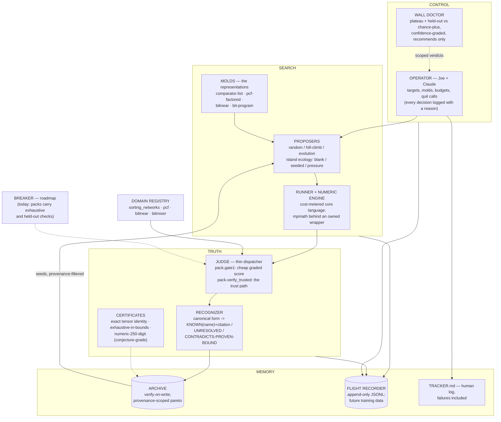
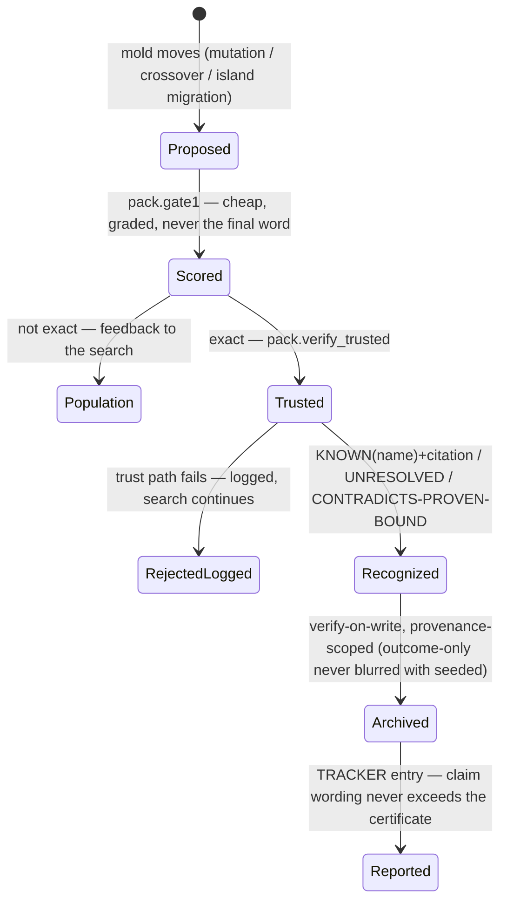

# foundry

Algorithm Foundry is a domain-pluggable search engine that proposes
candidate algorithms, executes them in a cost-metered language, verifies
correctness, attacks its own survivors, compares against known references,
diagnoses search walls, and records every action as training data for
future automation.

The goal: find better, faster, more efficient algorithms — in any and all
domains. Or, at minimum, be the project that honestly tries.

- [PROMPT.md](PROMPT.md) — the mission, the machine, the win ladder
- [RULES.md](RULES.md) — operating rules (claims need artifacts; claim
  wording never exceeds its certificate; predeclare budgets and cost rules)
- [TRACKER.md](TRACKER.md) — the experiment log, failures included. Read
  this to see what is actually real.
- [docs/audit_2026-06-12.md](docs/audit_2026-06-12.md) — the self-audit
  (findings, errata, known gaps)
- `reference/mathlab/` — the frozen parent project (public as
  [rediscovery-engine](https://github.com/Joe-b-20/rediscovery-engine.)),
  whose wall taxonomy and honesty rules this project inherits

## The machine

A **domain pack** plugs in through the registry as: a problem source, an
exact checker (`gate1` for cheap graded search scoring, `verify_trusted`
for the trust path), predeclared cost rules, and a self-verified reference
shelf with citations. Four domains are live through the one generic
engine.

## Life of a candidate

## Status: calibration ladder complete (proof-it-works phase, re-proven)

| rung | domain | result |
|------|--------|--------|
| floor | sorting networks | proven-optimal sizes from outcome at n=3..8 (islands closed n=6, n=8); optimality independently re-certified by exhaustion at n≤4 |
| middle | polynomial continued fractions | parent's seeded walks replicated 3/3 seeds with per-generation controls; **RM 8/(7ζ₃) rediscovered from outcome** in a predeclared 585,600-candidate sweep (Apéry in-grid control, empty null arms) |
| middle | bilinear decompositions | **Karatsuba rediscovered and NAMED** (exact canonical match, Karatsuba & Ofman 1962) in 3/3 seeds; R=3 proven optimal by a flattening bound computed exactly in-repo |
| roof | bit-mixers + wall doctor | exam 9/9: finds planted programs (sometimes shorter than the plant, verified exhaustively on all 65,536 pairs), abandons a keyed 8-round mixer on held-out-at-chance evidence, and never confidently abandons the deceptive grokking case (C3); a real gen-2303 grok survived the doctor (0/6 wrongly killed) |

## Portfolio (the actual mission, in progress)

Domain #1 — numerical approximants (float32; exhaustive-over-all-floats
verification is this domain's 0/1 principle):

- **rsqrt**: searching all 2³² magic constants from outcome (structure +
  calculus-derived Newton step given) found `0x5F375A87` — one integer
  from Lomont 2003's published optimum, and the best of the tested set
  over ALL 2,130,706,432 positive normal float32 under our declared
  metric (max rel error vs float64 reference; Lomont's own table used a
  float32 reference, so the last-digit rankings are metric-scoped —
  stated side by side, no supersession claimed). Three search-design
  failures en route are in the tracker.
- **tanh**: weighted-Remez minimax floors (proven for the polynomial
  class, equioscillation-verified in-repo) + from-outcome coefficient
  calibration landing within 0.04–0.09% of those floors (Lawson IRLS on
  outcome samples + true-metric bit polish). The beyond-polynomial hunt
  (bit/float hybrids vs the proven floors at equal ops) reports its
  verdict — find or honest null — in the tracker.
- Next on the list: gelu, sigmoid, exp, log, sqrt, sin, cos, erf,
  softplus (Joe's order, adjusted by headroom).

Everything above re-runs with one command — the standing regression
gauntlet (19/19 module sanities + 9 stages, ~110 s on CPU, ends with the
claims-vs-artifacts audit):

    python3 -m scripts.run_proof_phase

## The honesty mechanics, briefly

Exact verification is the floor, not a feature: nothing is archived
without independent re-execution, search-time scores never get the final
word, provenance separates discovered-from-outcome from shelf-seeded
structurally, generalization is judged on held-out data the search never
saw, every claim carries a certificate and its wording may not exceed it,
budgets and cost rules are timestamped before any search starts, and the
tracker keeps the failures — including the audit's own errata.

## Layout

    engine/    core language, runner, molds, proposers, islands, judge,
               recognizer, archive, doctor, recorder, registry, numeric
    domains/   one pack per domain + self-verified shelves (with citations)
    scripts/   runnable experiments incl. run_proof_phase (the gauntlet)
    runs/      every run's predeclared spec, event log, report, artifacts
    docs/      audits and write-ups
    reference/ the frozen parent project
