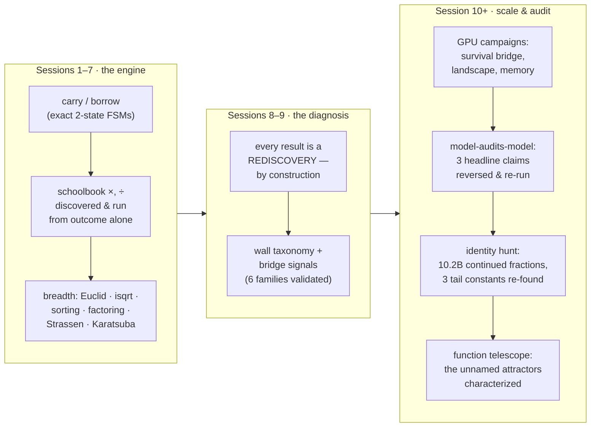
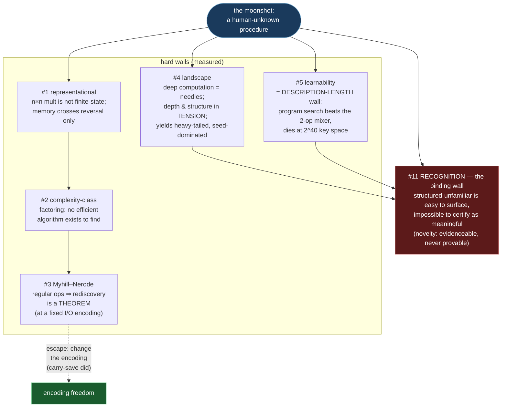
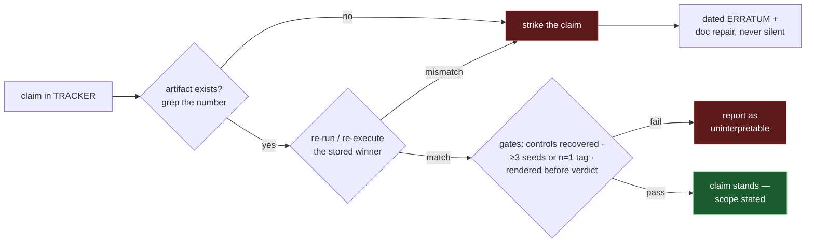
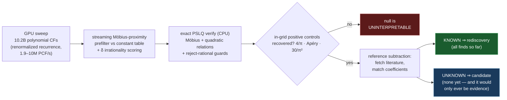

# rediscovery-engine

**Can a small, from-scratch neural system discover its own mathematical algorithms — and can it ever discover one humans don't know?**

An independent ML research project. ~11 sessions, an RTX 4060 laptop, ~$12 of rented RTX 4090. One uncompromising test everywhere: **length generalization under exact integer evaluation** — train on short inputs, test on long ones; a lookup table collapses, a real algorithm stays at 1.000; no partial credit, ever.

Three results came out:

1. **A rediscovery engine.** One recipe (exact-filtered self-imitation + an efficiency budget) reliably finds the *canonical efficient algorithm* across a dozen domains — carry, borrow, schoolbook multiply/divide, Euclid, binary-search & Newton isqrt, bubble & selection sort, √n trial division, **Strassen**, **Laderman**, **Karatsuba**, and carry-save addition when given freedom over its own number code.
2. **An obstruction theory** — a measured map of *why the novel algorithm never appears* (the wall taxonomy below), ending at one binding wall: **recognition**.
3. **A reliability protocol for AI-assisted research** — a successor model audited the first model's claims against artifacts, reversed three headline findings, and every reversal was confirmed by re-running the experiments.

> **No novelty is claimed anywhere in this repo.** Its verified "finds" — including an independent re-derivation of the Ramanujan Machine's unproven 8/(7ζ(3)) conjecture and a published Catalan-constant continued fraction — are rediscoveries, classified as such by an automated literature-subtraction step. That discipline *is* the contribution.

---

## The arc



## Why nothing novel appears: the wall taxonomy



Retired along the way (by the audit + re-runs): *"the primitive vocabulary bounds novelty"* (proves too much — every algorithm ever published is a composite of known primitives), *"QD is the wrong tool for rugged landscapes"* (an archive-corruption artifact; fixed, the verdict **inverts**), and *"the memory net fits multiplication"* (a misread, width-stratified loss).

## The audit loop (how this repo keeps itself honest)



Applied for real: the audit ([consolidation/09](consolidation/09_fable5_audit.md)) re-verified ~30 claims (~22 reproduced exactly), found 3 evidence-contradicted headlines, and the closure re-runs confirmed **every** reversal — including one where the corrected result is a *better* finding (MAP-Elites with a depth-aligned descriptor **beats** plain evolution 2139 vs 675).

## The identity hunt (the one direction where "win" is defined)



What it re-derived **from outcome alone**, verified to 250 digits, then correctly classified as known: the Ramanujan Machine's unproven **8/(7ζ(3))** conjecture (exact coefficients), a published **Catalan-constant** CF (1/2G — the κ=0 member of [arXiv:2210.15669](https://arxiv.org/abs/2210.15669)), and **8/π²**. Past the published coefficient region: only known forms. Total cost ≈ $12.

## Repo map

| path | what |
|---|---|
| [`TRACKER.md`](TRACKER.md) | **the lab notebook** — 110+ append-only entries, every experiment incl. failures, dated errata |
| [`consolidation/`](consolidation/README.md) | the distilled docs: arc · methodology · wall taxonomy · experiment catalog · bridge signals · code map · open frontiers · what-not-to-redo · **the audit (09)** · phase-2 results (10) |
| [`src/`](src/README.md) | all experiment code (flat — sibling imports), `expA…expGG`, `gpu_*`, the identity pipeline, the function telescope |
| [`scripts/`](scripts/) | orchestration (local + RunPod detached-campaign pattern), env setup |
| [`runs/`, `runs_pod/`](runs_pod/) | the evidence: logs, JSON results, checkpoints, renders (oversized binaries are pointered to a gitignored store) |
| [`writeup/`](writeup/mathlab_writeup.md) | long-form draft (the science · the audit story · the methods note) |
| [`PLAYBOOK.md`](PLAYBOOK.md) | executor-agnostic operating protocol + verification gates |
| [`PROMPT.md`](PROMPT.md) / [`ARCHITECTURE.md`](ARCHITECTURE.md) | the original goal & the locked substrate |

## Quickstart

```bash
# env: conda env "mathlab" (py3.11, torch 2.6 cu124) — see scripts/env/setup_env.sh
bash run.sh src/expJ_selfdiscover.py --ops mul,div --iters 160 --seed 0   # discover ×,÷ from outcome
bash run.sh src/expK_gcd.py --iters 120 --seed 0                          # GCD → Euclid
bash run.sh src/expN_matmul.py --m 2 --k 2 --p 2 --Rmax 8 --Rmin 6        # 2×2 matmul → Strassen
bash run.sh src/expCC_ladder.py                                          # the Myhill–Nerode ladder (pure python)
bash run.sh src/expFF_search.py                                          # the description-length wall, measured
bash run.sh src/gpu_pcf_hunt.py --selftest                               # identity pipeline self-test
bash run.sh src/fn_telescope.py --selftest                               # function telescope controls
```

## Ground rules (the short version)

Exact eval, no partial credit. Tracker is sacred and append-only. Claims need artifacts. Comparative claims need seeds. Re-execute archived winners. Render before verdict. State the scope when upgrading an observation to a law. **No manufactured novelty.** Full version: [`.claude/RULES.md`](.claude/RULES.md).

## Status & where it goes next

The moonshot is **open, honestly placed**: the walls are measured, the recognition problem is the binding constraint in every object space tested (and half of it is provably out of reach — novelty can be evidenced, never proven). Live directions: the **function telescope** (characterizing the structured-unnamed attractors target-free search produces — their algebraic degree provably tracks substrate depth), **encoding freedom** for regular ops (the one theorem-licensed escape, demonstrated once by carry-save), and the identity instrument held ready for a designed, larger-height campaign.

*Lead: Joe Bachir. Research assistance: two generations of Claude (Anthropic) — one of which audited the other; see §B of the [writeup](writeup/mathlab_writeup.md).*
