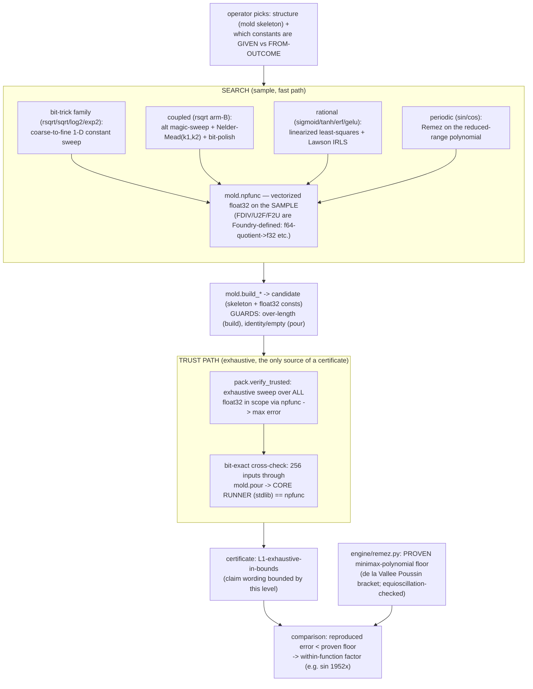
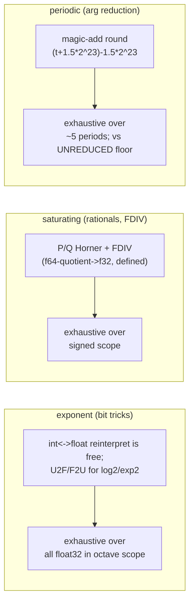

# Foundry audit — 2026-06-13 (numerical-approximants expansion)

Second full audit, triggered after the approximants domain grew fast (13
functions) and the engine changed substantially since the 2026-06-12 audit:
FDIV, U2F/F2U/AND32/OR32 ops, the silent-failure guards, `engine/ratfit.py`,
`engine/remez.py` robustness, and the mold rational/gelu builders. The
risk this audit targets: stale claims, engine changes silently shifting old
numbers, documentation drift, and diagrams showing intended rather than
actual flow. New discovery work was paused for it.

## Verdict

**Every claim reproduces under the current engine; no mismatch, no drift.**
- **Approximants: 14/14 certified numbers reproduced** by re-running each
  deterministic hunt under the current engine and reconciling against the
  committed claim ledger (`scripts/run_approximants_audit.py`,
  `runs/approximants-audit-1781463104/reconciliation.json`). Every number
  matches to 5–6 significant figures (within the predeclared rtol).
- **Calibration / control domains: green** via the gauntlet — 32/32 module
  sanities + 10 stages (sorting networks, exhaustion certs, islands, PCF
  replication + sweep, Karatsuba, doctor C1/C2/C3, grokking probe, tanh
  calibration, claims-vs-artifacts audit), `runs/proof_phase-1781463511`.

## Reconciliation table (claim ↔ reproduced ↔ scope/metric/provenance)

All errors are exhaustive over the stated scope. Metric is per-function;
factors are within-function only (never cross-compared).

| result | ops | claimed | reproduced | metric | scope | provenance |
|---|---|---|---|---|---|---|
| rsqrt A87 | 7 | 1.751288e-3 | 1.751288e-3 | rel | all normal float32 [2⁻¹²⁶,2¹²⁸) | structure+Newton GIVEN; **magic from outcome** |
| rsqrt arm-B (Moroz-class) | 7 | 8.787168e-4 | 8.787168e-4 | rel | float32 [2⁻⁸,2⁸) | **magic+k₁+k₂ from outcome** (coupled) |
| sqrt via-rsqrt | 8 | 1.7513e-3 | 1.751319e-3 | rel | float32 [2⁻⁸,2⁸) | composition x·rsqrt_A87 (own artifact) |
| log2 L3 | 3 | 4.3043e-2 | 4.30429e-2 | abs | float32 [2⁻⁸,2⁸) | trick (Blinn) given; **slope+offset from outcome** |
| exp2 Schraudolph | 3 | 2.9827e-2 | 2.98269e-2 | rel | signed |x|∈[2⁻⁸,2³) | slope FIXED 2²³; **bias from outcome** |
| sigmoid [2/2] | 9 | 3.0817e-2 | 3.08173e-2 | abs | signed |x|∈[2⁻⁴,2³) | rational coeffs from outcome |
| sigmoid [3/3] | 13 | 2.6522e-3 | 2.65219e-3 | abs | signed |x|∈[2⁻⁴,2³) | rational coeffs from outcome |
| tanh [2/2] | 9 | 1.6959e-2 | 1.69592e-2 | rel | [2⁻²,2³) | rational coeffs from outcome |
| tanh [3/3] | 13 | 1.0066e-3 | 1.00659e-3 | rel | [2⁻²,2³) | rational coeffs from outcome |
| erf [2/2] | 9 | 1.8437e-1 | 1.84368e-1 | abs | signed |x|∈[2⁻⁴,2³) | rational coeffs from outcome |
| erf [3/3] | 13 | 3.3812e-2 | 3.38118e-2 | abs | signed |x|∈[2⁻⁴,2³) | rational coeffs from outcome |
| gelu x·[3/3] | 14 | 6.0295e-2 | 6.02951e-2 | abs | signed |x|∈[2⁻⁴,2³) | x·rational(Φ); coeffs from outcome (|x|-weighted) |
| sin | 13 | 5.1240e-4 | 5.12401e-4 | abs | signed |x|∈[2⁻⁶,2⁴) | arg-reduction (math consts given); poly from outcome |
| cos | 14 | 5.1272e-4 | 5.12715e-4 | abs | signed |x|∈[2⁻⁶,2⁴) | cos=sin(x+π/2); same poly |

## Documentation-drift check (prose factors ↔ reproduced errors + floors)

The README/TRACKER state win *factors* (ratios to proven floors). Each is
consistent with the reproduced error and the proven floor:

- log2: 4.304e-2 vs deg-1 floor 5.5431 → 128.8× (stated "129×") ✓
- exp2: 2.983e-2 vs deg-3 floor 0.93044 → 31.2× (stated "31×") ✓
- sigmoid [3/3]: 2.652e-3 vs deg-6 floor 4.0853e-2 → 15.4× ✓
- tanh [3/3]: 1.007e-3 vs deg-6 rel floor 7.963e-3 → 7.9× ✓
- erf [3/3]: 3.381e-2 vs deg-6 floor 2.8821e-1 → 8.5× ✓
- gelu x·[3/3]: 6.030e-2 vs deg-7 floor 1.561e-1 → 2.6× ✓
- sin: 5.124e-4 vs unreduced deg-7 PROVEN floor 1.0 → 1952× ✓
- rsqrt arm-B: 8.787e-4 vs A87 1.751288e-3 → 1.993× ✓

No drift. The one place to keep watch, restated from the source entries:
**rsqrt arm-B and exp2 bias are flagged "matching-class pending a citation
check"** (Moroz/Walczyk/Cieśliński and Schraudolph respectively) — we do
NOT claim our exact constants are theirs, only that the from-outcome result
lands in their published improvement class.

## How each result actually moved through the engine

The real pipeline (not the idealized architecture). The defining honesty
mechanism is the **two-path split**: search runs on the fast vectorized
path over a SAMPLE; the certificate comes only from the exhaustive sweep
over EVERY float32 in scope, cross-checked bit-for-bit against the
stdlib-only core runner.

Per-family verification specifics (all reach the same TRUST PATH):

## Findings

| id | severity | finding | action |
|----|----------|---------|--------|
| G1 | clean | 14/14 approximant claims reproduce under the current engine (FDIV/conversions/guards/ratfit/remez all post-date most results) | none — claims stand |
| G2 | clean | calibration/control domains reproduce (gauntlet 32 sanities + 10 stages) | none |
| G3 | clean | every prose win-factor is consistent with reproduced error ÷ proven floor | none |
| G4 | re-affirmed | rsqrt arm-B / exp2 bias remain "matching-class pending citation"; not claimed as the published exact constants | keep the flag in all docs |
| G5 | re-affirmed | metrics differ per function (abs vs rel); factors are within-function only | never cross-compare in prose |
| G6 | scope note | sin/cos use single-2π reduction (valid for |x|<16, ~1e-6 reduction error); rsqrt arm-B verified on [2⁻⁸,2⁸) sub-scope | a full-normal arm-B re-verify is a cheap logged follow-up |
| G7 | tooling | `run_approximants_audit.py` is ~6 min (187s is the full-domain rsqrt re-verify); has a `fast` mode that skips it | kept on-demand, not in the ~2-min gauntlet |

## Standing limits (re-affirmed)

- Certificates are L1-exhaustive (every float32 in the declared scope) vs a
  float64 reference; not ULP-correct-rounding claims.
- FDIV is **Foundry-defined** (f64 quotient rounded to f32), not IEEE f32
  division — the label stays visible wherever FDIV results appear.
- The polynomial floors are real-arithmetic minimax (de la Vallée Poussin
  bracket); compared against float32 programs they are conservative for the
  polynomial, so every factor is a lower bound on the gap.
- gelu's absolute error is high in practical terms over [-8,8] at 14 ops;
  its win is equal-op vs the polynomial, scoped — not "gelu solved".

## Reproduce

    python3 -m scripts.run_approximants_audit        # ~6 min, 14 claims
    python3 -m scripts.run_approximants_audit fast    # skip 187s full rsqrt
    python3 -m scripts.run_proof_phase                # gauntlet (calibration)
